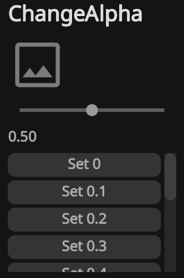

# Introduction
RimGui & RimGui Extensions

# RimGui

## Introduction  
**RimGui** is an easy-to-use code-driven GUI library designed for rapid iteration. 
Build user interfaces quickly and efficiently with minimal code. It's perfect not only for debugging tools but also for integrating smooth and responsive UI into actual gameplay.

Works with all Unity versions 2021+ including 2021, 2022, 2023 & Unity 6.

**Render Pipeline Support**  
- Supports Built-in Render Pipeline, URP, and HDRP.

**Customizable**  
- Easily tweak various parameters to fit your needs.  
- You can also create custom widgets from scratch.
- You can even render freely from the triangle mesh level for complete control.

**Cross-platform Support**  
- Works not only on PC but also on WebGL and mobile platforms.

**Font Support**  
- Supports custom fonts and texture atlas generation.

**High-Performance Immediate Mode GUI (ImGui)**
- Designed for high performance, with efforts to minimize GC (Garbage Collection) allocation.

**Targets both developers and end-users:**
- RimGui targets not only developers but also **user interfaces for players enjoying the game.**

**Flexible Scalability:**
- You can easily change the size and scale of UI widgets, making it **simple to support multiple resolutions.** This enables optimal UI display across various screen sizes.


It's not designed for GUIs that require flashy effects, but it's perfect if you need a simple and clean interface.

## Example Code

```csharp
Gui.Heading("ChangeAlpha");

using (ImageColors.Begin(new Color(1f, 1f, 1f, alpha)))
    Gui.Image(Sprite);

Gui.Slider(ref alpha, 0f, 1f);
Gui.Text(alpha.ToString("F2"));

if (Gui.NextHeight(100f).BeginScroll())
{
    for (int i = 0; i < 11; i++)
    {
        if (Gui.Button($"Set {i / 10f}"))
            alpha = i / 10f;
    }
    Gui.EndScroll();
}
```
The following UI is displayed by the code above.


---

## Goals
- Easy-to-use GUI library
- Rapid UI creation
- Simplicity
- High performance
- Usable not only for debugging and tools but also in actual games
- Minimal dependencies

---

## Non-goals
- Support for GUIs with heavy visual effects  

---

## Features  
- Box  
- Button  
- ToggleButton  
- RadioButton  
- CheckBox  
- ColorPreview
- Custom
- Foldout  
- Frame
- InputText  
- Scroll  
- Separator  
- Slider  
- Sprite  
- Text  
- Texture  
- Window  
- Heading
- Spacing
- InteractiveItem
- Drag and Drop  
...and many more.


## Differences Between Unity IMGUI and RimGui

- **Targets both developers and end-users:** While Unity IMGUI is primarily for developer tools, RimGui targets not only developers but also **user interfaces for players enjoying the game.**
- **High-Performance Design:** RimGui is designed for high performance, including efforts to **minimize GC (Garbage Collection) allocation.**
- **Modern Rendering Pipeline Compatibility:** RimGui is compatible with the **URP (Universal Render Pipeline) and HDRP (High Definition Render Pipeline)**, enables seamless integration with the latest Unity projects.
- **Wide Platform Support:** RimGui supports a diverse range of platforms, including **PC, Mobile, and WebGL**, allowing you to **target your desired environments without limitations.**
- **Flexible Scalability:** With RimGui, you can easily change the size and scale of UI elements, making it **simple to support multiple resolutions.** This enables optimal UI display across various screen sizes.

## Links
[AssetStore Page](https://assetstore.unity.com/packages/slug/316805)
[Demo](https://gridrand.com/rimgui/webgl/core)
[Github](https://github.com/Gridrand/RimGui)
[Introduction \| RimGui](https://gridrand.com/rimgui/docs/introduction)
[Unity Discussions](https://discussions.unity.com/t/released-rimgui-code-driven-gui-library/1637582)

## Support
If you have any bugs or feature requests, please submit them via [this page](https://github.com/Gridrand/RimGui/issues).
For direct support, you can reach us at **support [at] gridrand [dot] com**.
You are also welcome to post questions or feedback on the [Unity Discussions](https://discussions.unity.com/t/released-rimgui-code-driven-gui/1637582) thread.


# RimGui Extensions
## Introduction  
This extension pack for RimGui offers a wide variety of widgets, including dropdowns and several types of input controls.
RimGui is required to use this pack.

## Features
- SliderNumeric
- Text
  - Various numeric types
  - bool
  - char
- Splitter
- VerticalBarHandle
- SnapVerticalBarHandle
- RectInnerPointHandle
- SnapRectInnerPointHandle
- Hyperlink
- Label
- ComboBoxButton
- SlidePad
- EditableText
- Dropdown
- InputDropdown
- DragInput
- Input
  - Various numeric types
  - char
  - bool
  - Vector2
  - Vector3
  - Vector4
  - Vector2Int
  - Vector3Int
  - Rect
  - RectInt
  - Bounds
  - BoundsInt
  - Color
  - Color32
  - HsvColor
- Utilities for drawing tree
...and many more.

For more details, please refer to the Demo.

## Links
[Demo](https://gridrand.com/rimgui/webgl/extensions)
[Github](https://github.com/Gridrand/RimGui)
[Introduction \| RimGui](https://gridrand.com/rimgui/docs/extensions/introduction)
[Unity Discussions](https://discussions.unity.com/t/released-rimgui-code-driven-gui/1637582)

## Support
If you have any bugs or feature requests, please submit them via [this page](https://github.com/Gridrand/RimGui/issues).
For direct support, you can reach us at support [at] gridrand [dot] com.
You are also welcome to post questions or feedback on the [Unity Discussions](https://discussions.unity.com/t/released-rimgui-code-driven-gui/1637582) thread.